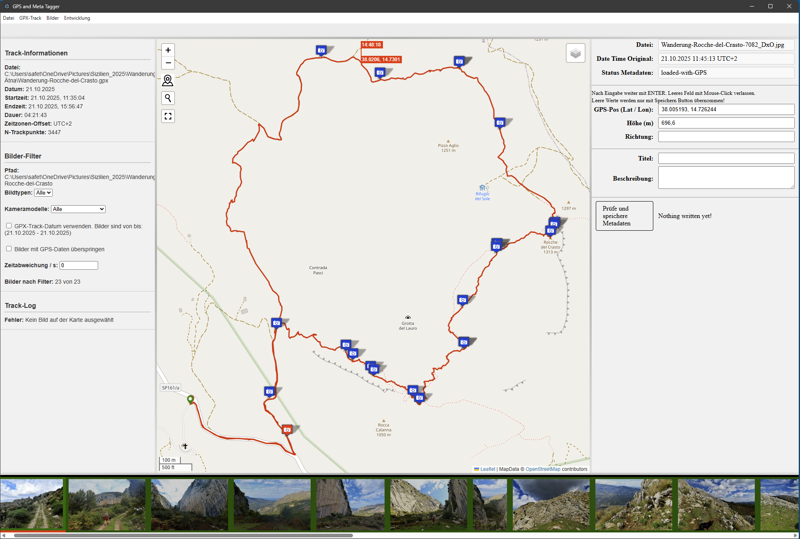

# GpxTaggerApp -- Photo Geotagging and GPX Viewer

Electron-Panes is a desktop application based on Electron that allows
you to:

-   Load photos from a folder and display EXIF metadata
-   Load GPX tracks and display them on a Leaflet map
-   Add GPS information (geotagging) to photos or adjust existing GPS
    data
-   Write metadata (title, description, GPS) back into the image files

## Requirements

-   **Operating System**: Windows10/11, macOS, or Linux
-   **Node.js**: Recommended LTS version (e.g. 20.x)
-   **ExifTool**: Must be installed on the system and available in the
    `PATH`\
    (i.e., the command `exiftool` must work in the terminal / command
    prompt).
-   **exiftool-vendored** also includes ExifTool within the node
    modules.

## Screenshot


## Disclaimer

This tool is not a professional application. There are other tools that
serve the same purpose:

-   PhotoLocator - https://github.com/meesoft/PhotoLocator - OSS,
    Windows only (currently my favorite)
-   darktable - https://www.darktable.org/ - OSS
-   GeoTagNinja - https://github.com/nemethviktor/GeoTagNinja - OSS,
    Windows only
-   Lightroom - still the best, but due to the outrageous pricing policy
    no longer usable for me.
-   There are many other tools for Linux, macOS, and Windows that
    personally did not appeal to me, but that is a matter of taste.

This app was developed with heavy use of various AI tools: Sourcery,
chatGPT, MS Copilot, Windsurf, GitLens, and occasionally good old Google
search.

## Installation (EXE for Windows)
1. Download the Release, unzip and run the `GpxTaggerApp.exe`. There is no 'real' installer. Unzipping is good enough.
2. Signing / Certificates
Up to my knowledge there is no free AND useful Signing for Windows Apps. The same for macOS and for Linux I don't know. As I couldn't test the signed exe or installer on other Systems I prepared the *.exe for Windows only. The Defender will warn you on unzipping.

## Installation (Developer Setup)

1.  Clone the repository or download the source code and unzip to any folder.

2.  Install dependencies in the project folder:

    ``` bash
    npm install
    ```

3.  Start development mode: `bash     npm run all`

4.  Build the application (Build currently only tested for Windows)

    `bash     npm run package` (Windows) --> ./dist\
    `bash     npm run package:linux` (Linux) --> ./dist-linux\
    `bash     npm run package:max` (maxOS) --> ./dist-mac\
    
    Note: The generated dist folder is about 400 MB and the Releas ~ 220 MB.
5. Signing / Certificates\
Up to my knowledge there is no free AND useful Signing for Windows Apps. The same for macOS and for Linux I don't know. As I couldn't test the signed exe or installer on other Systems I prepared the *.exe for Windows only. The Defender will warn you on unzipping.

## Starting the Application (from IDE or as EXE)

After startup, the main window opens with:

-   left sidebar: GPX track information and geotagging controls
-   center area: Leaflet map and optionally a track chart if previously
    selected
-   bottom area: thumbnail bar with your images, if previously selected
-   right sidebar: metadata of the currently selected image
-   if no images and no GPX track are selected, the areas remain empty.
    The map is shown in the last view.

The application remembers the last window size, position, language, and
paths (settings are stored as JSON in the user directory and not in the
project folder so they are not lost after a new build).

### Resize Panes
The Panes or Areas of the App are resizable. Do this as you like it. The Set-up will be stored in the user-settings.json and reloaded. Mind that working on different screens the position and size will NOT be correct. This is supposted to be an limitation off Electron.

### Language / Localization

The app detects the system language (app.getLocale()). Supported
languages depend on the configuration in the folder
locales/`<language>`{=html}/translation.json. Currently only DE and EN
translations are available. Fallback language is English.

### Debug Logging

When starting from the IDE as well as from the EXE, debugging
information is written to the file `geotagger.log`. Paths are: -
Windows: `C:\Users\<USERNAME>\AppData\Roaming\<AppName>\geotagger.log` -
Linux: `/home/<USERNAME>/.config/<AppName>/geotagger.log` - macOS:
`/Users/<USERNAME>/Library/Application Support/<AppName>/geotagger.log`

This feature cannot currently be disabled.

# Typical Workflow

## Select Images

**Menu:** `Image Folder → Select Folder`

First, select a folder containing images. Supported file extensions
include:

-   `jpg`
-   `webp`
-   `avif`
-   `heic`
-   `tiff`
-   `dng`
-   `nef`
-   `cr3`

The extensions can be defined in `user-settings.json`. This file is
located in the same path as the log file (see above).

``` json
"extensions": [
    "jpg",
    "webp",
    "avif",
    "heic",
    "tiff",
    "dng",
    "nef",
    "cr3"
  ],
```

### Process

The app:

1.  reads all files in the folder, which can be aborted with 'Abort'.
    This may take some time, especially the first time, as thumbnails
    are generated for display. There is no progress indicator.

2.  filters by detected extensions and missing/existing GPS data and
    whether they are "within" the selected GPX track.

3.  extracts EXIF metadata using `exiftool-vendored`

4.  generates thumbnail files if embedded in the image files, otherwise
    not.

5.  sorts images by `DateTimeOriginal`.

6.  displays:

    -   a thumbnail bar at the bottom
    -   metadata of the first image in the right sidebar. GPX, title,
        and description can be edited there. Afterwards, save
        immediately using the button below, see further below.

**Reset folder:** `Image Folder → Reset Folder`

### Performance Logs (Console)

If Browser DevTools/Terminal is open, loading times are displayed for:

-   Reading file list
-   EXIF extraction
-   Sorting
-   Index assignment

------------------------------------------------------------------------

## Load GPX Track

**Menu:** `GPX Track → Open GPX File`

Select a `.gpx` file.

### The app:

-   loads the track and displays it on the map

-   calculates track information:

    -   Number of track points
    -   Start/end date
    -   Start/end time
    -   Duration
    -   Time zone and UTC offset

-   displays track info in the left sidebar and, if enabled, the number
    of images that lie within the track (assignment by time).

**Remove track:**

`GPX Track → Clear GPX File`

------------------------------------------------------------------------

## Geotagging via GPX and exiftool

For images without GPS data:

### Requirements

-   Images selected and GPX file loaded, see above.

### Process

1.  In the left sidebar (tracklog area):

    -   Specify time offset (if camera time differs from tracklog)
    -   TIP: It is best to take a photo of the device showing the time
        at the beginning of the track, so the deviation is documented.
    -   Click RESET button to set the offset to zero if there is no time
        deviation or it can no longer be reconstructed.

2.  Start geotagging by clicking the button:

    -   Call in main process:

            geotagImageExiftool(gpxPath, imagePath, options)

3.  ExifTool writes GPS data directly based on timestamp. ExifTool also
    creates a backup in the same folder, which can be restored in case
    of errors.

4.  After completion, images are reloaded and displayed on the map. This
    allows verification of the result.

#### After successful run

-   Image status → `geotagged`
-   Thumbnail marking is adjusted
-   Reload metadata (`Reload Data`) is triggered automatically.

------------------------------------------------------------------------

## Geotagging WITHOUT GPX Track

### Process

1.  Load images. They are highlighted in red in the thumbnail bar. On
    the left, the number of images WITHOUT GPS data is displayed. If
    images with GPS data are loaded AND the checkbox for display is
    active, the number is zero. The checkbox must therefore be disabled
    to overwrite existing GPS data!
2.  Activate desired images in the thumbnail bar (single or multiple
    selection)
3.  Select desired location on the map, either directly or via location
    search.
4.  CTRL + left-click assigns GPS data and altitude to the selected
    images.
5.  Immediately save the new data using the button in the RIGHT sidebar.
    Only the currently ACTIVE images are saved!
6.  Verify result: Menu item: Reload metadata (`Reload Data`),

------------------------------------------------------------------------

## Display Images on the Map

As soon as images with GPS data are available:

-   Markers are placed on the map (possibly different icons for
    image/video)

-   Hover over marker:

    -   Popup with image index, title, and thumbnail

-   Click on image marker:

    -   Marker becomes active (icon color/shape changes)
    -   Corresponding thumbnail is activated. Any existing
        multi-selection is reset.

------------------------------------------------------------------------

## Select Images

### via Thumbnails

**Single click:**

-   Image becomes active
-   Metadata appears on the right and can be edited, see below.
-   Note: Deleting title and description is currently not possible.
-   Map zooms/centers (depending on configuration) on the active image.

**Multiple selection with Shift-click:**

-   Shift key + left-click on first and last image of the desired range:
    mark multiple thumbnails as active

-   Display and edit metadata (as with single image):

    -   common values shown if identical.
    -   or `multiple` if values differ.
    -   Values can be overwritten and should then be saved immediately.
        Note: Changes are ONLY applied if `ENTER` is pressed in EACH
        input field at the end!
    -   Note: Deleting title and description is currently not possible.
        (Or simply enter '' or a Space '_'.)

------------------------------------------------------------------------

### Via the Map

**Click on marker:**

-   triggers `mapmarkerclick` event
-   activates corresponding thumbnail
-   updates metadata in the sidebar

------------------------------------------------------------------------

## Edit Metadata (right sidebar)

Editable fields (for one or multiple images):

Note: Changes are ONLY applied if `ENTER` is pressed in EACH input field
at the end! Deleting title and description is currently not possible.

### GPS Position (Lat/Lon)

-   Input e.g.: `48.8588443, 2.2943506`

-   supports formats understood by `coordinate-parser`

-   `Enter`:

    -   confirms
    -   converts to normalized format
    -   Status e.g. `gps-manually-changed`, displayed in a different
        color in the thumbnail bar.

### Altitude & Direction

-   numeric inputs, range validation active, otherwise same as GPS.

### Title & Description

-   text fields

-   Save via:

    -   `Enter`
    -   Save button

------------------------------------------------------------------------

### Behavior with Multiple Selection

-   Different values → display `multiple`
-   Changes can be applied to all selected images

------------------------------------------------------------------------

## Save Metadata

After changes:

**Button:** `Accept / Save`

### Process

1.  Collect changed fields

2.  Validation:

    -   GPS format
    -   altitude range
    -   etc.

3.  Send to main process (`save-meta-to-image`)

4.  Write to file via `exiftool.write`

### Progress

IPC events:

-   `save-meta-progress`

    -   `done`
    -   `error`
    -   `skipped`

------------------------------------------------------------------------

### Exit with Unsaved Changes

Dialog options:

-   **Save**

    -   writes unsaved metadata
    -   then exits the app

-   **Discard**

    -   discards changes
    -   exits immediately

------------------------------------------------------------------------

## Menu Overview

### File

-   `Reload` (Dev/Test) -- reload UI
-   `Reload Data` -- reload image data
-   `Quit` -- exit application

### GPX Track

-   `Open GPX File`
-   `Clear GPX File`

### Image Folder

-   `Select Folder`
-   `Clear Image Folder`

### Development (Dev mode only)

-   `Open DevTools` (F12)

------------------------------------------------------------------------

## Keyboard & Interaction Notes

-   **Shift + Click (Thumbnail)** → range selection

-   **Right-click (Thumbnail)** → multi-selection mode

-   **Shift + Arrow left/right** (when focus is on thumbnail bar) → move
    active selection

------------------------------------------------------------------------

## Error Handling & Logs

### Log File (Main Process)

For example for:

-   EXIF loading errors
-   ExifTool execution errors
-   File/path issues

### Typical Error Dialogs

-   `GpxFileNotFound`
-   `ImageFileNotFound`
-   `NoExiftool`

------------------------------------------------------------------------

## Known Limitations

-   The app was primarily intended for learning Electron. It is
    functional but has its quirks and may need to be restarted
    occasionally. Crashes are not expected. There are also several TODOs
    in the respective \*.js files, but none are "showstoppers". Main
    takeaway: Without clean architecture, API definitions, and upfront
    design, you quickly end up with spaghetti code.
-   Large image folders (hundreds/thousands of files, HDD/USB3) →
    Reading & thumbnail generation can take several seconds
-   ExifTool must be installed and accessible
-   Some event listeners (e.g. thumbnail bar) are intentionally not
    removed because the UI structure remains stable
-   I'm currently using an outdated Version of exiftool-vendored, because I found an Issue with V35.9.0, see https://github.com/photostructure/exiftool-vendored.js/issues/325

## Changelog

V1.0.0.0 : First public Release.